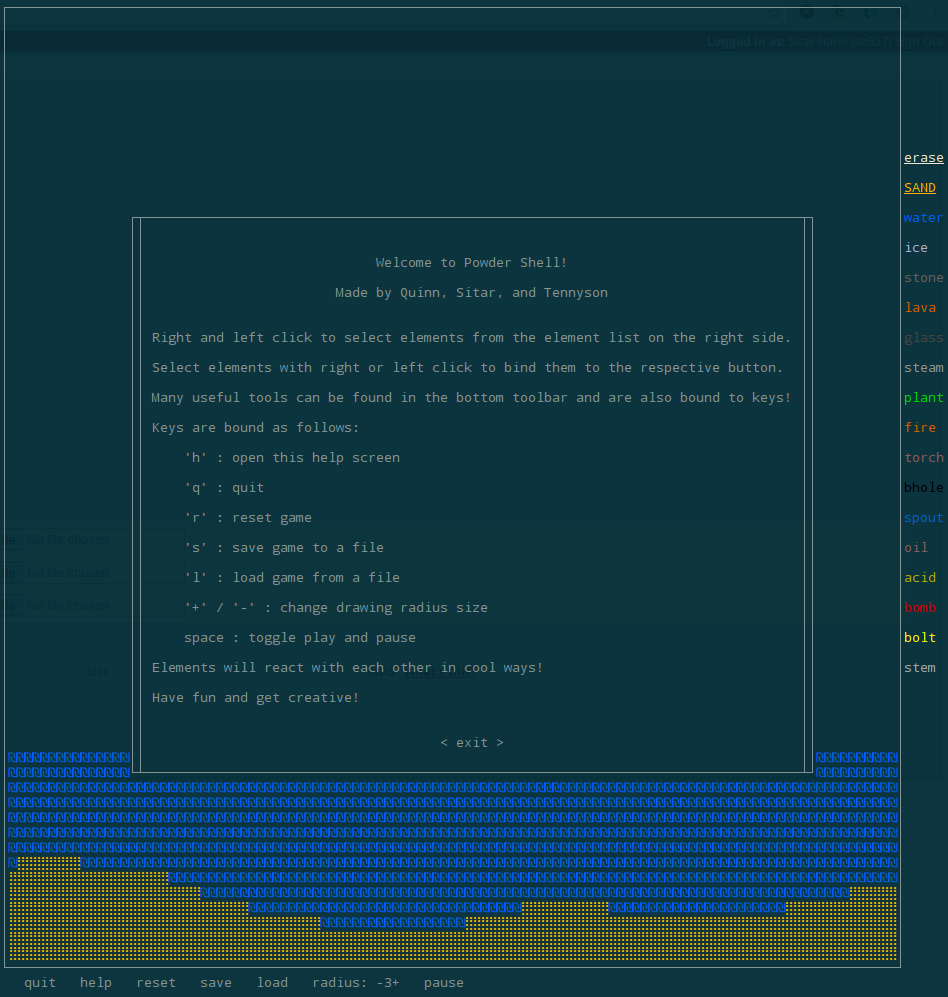

# Powder Shell

Created by Tennyson T Bardwell (ttb33), Quinn Halpin (qmh4), and Sitar Harel (sh927)

Created for CS 3110, Data Structures and Functional Programming, Fall 2016

## Installation

**NOTE:** Our system is known to run substantially slower on Macs which drastically reduces the creative experience. We've proudly shown our project to dozens of people who've collectively spent hours playing. We highly recommend using Linux to get the full effect of this project - even a virtual machine running Linux in Mac OS X will perform better than native Mac OS X.

This project uses Dune, and can be compiled in a Docker container. A pre-built docker image is available via `docker run -it --rm tennysontbardwell/powdershell`.

It can be built and run without docker via `cd src/ && make install-dep clean test main.exe`, and run via `src/main.exe`.

## Playing the Game

Launch the game and press `h` for help.

The save file 'beach' is pre-included; load it by pressing load and entering 'beach'.

### Sand

Sand will move to occupy any empty spaces below it, including the two diagonal spaces below it.

### Bomb

When ignited, bombs explode, causing a cascading shock wave and destroying matter nearby.

### Acid

Acid flows like a fluid, finding the lowest ground, and then corroding further down.

### Plant-Ice-Fire

Ice behaves like [Ice-nine](https://en.wikipedia.org/wiki/Ice-nine), as a seed crystal to transform liquid water into a solid. Plants have similar properties, albeit slower, and they have a more spectacular interaction with fire.

### Blackhole

Matter consumer.

### Stem

Matter replicator.

### Oil

A highly flammable fluid; necessary for energy independence in the 21st century.

### Gallery

## Testing, Compiling, Cleaning

Inside of the `src/` directory:

- Run `make test` to compile and run test cases.
- Run `make main.exe` if you wish to only compile. From here running `./main.exe` will launch the game.
- Run `make clean` to remove build files.
